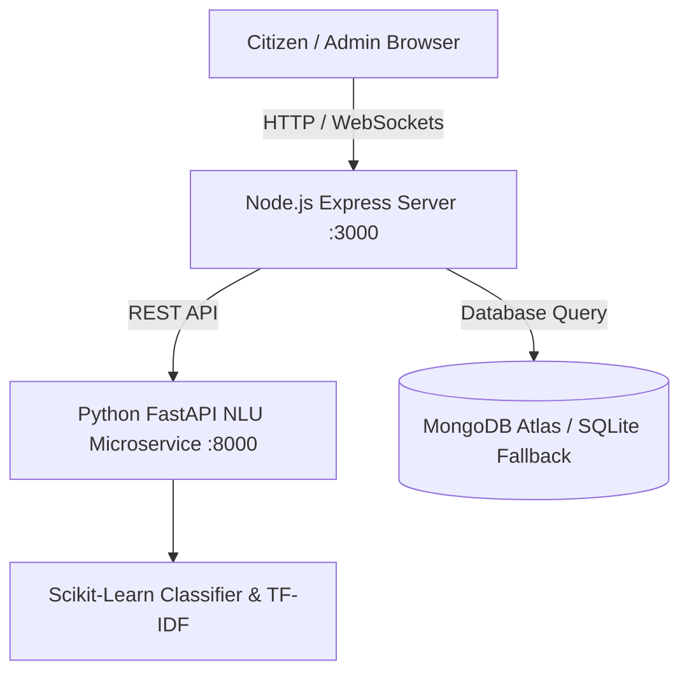

# 🌾 Gram Sahayak (ग्राम सहायक)
> **Real-Time Rural AI Assistance & Gram Swaraj Digital Governance Portal**

Gram Sahayak is a production-grade, multilingual AI-powered e-governance platform designed for rural Gram Panchayats. It enables rural citizens to seamlessly access government schemes, check land records (Bhulekh / 7-12 extracts), track pensions, and report civic issues directly to Panchayat officers using **voice or text** in **English, Hindi, and Marathi**.

---

## 🌟 Key Features

### 🇮🇳 1. Multilingual AI Assistant (English, Hindi & Marathi)
- **Voice & Text Chat**: Citizens can type or speak into their microphone in English, Hindi, or Marathi (`mr-IN`).
- **Conversational Small Talk LLM Layer**: Handles greetings (*"Namaste"*, *"नमस्कार"*), identity questions, compliments, and officer inquiries naturally.
- **3-Tier NLU Confidence Gater**:
  - **High Confidence (≥ 0.75)**: Instant direct answer & action buttons.
  - **Medium Confidence (0.45 - 0.75)**: Smart disambiguation chips asking the citizen to clarify.
  - **Low Confidence (< 0.45)**: Friendly rural fallback guide.

### 📜 2. Citizen Services Directory
Direct online applications & guidance for key central and state schemes:
- 🌾 **PM-Kisan Samman Nidhi**: ₹2,000 installment tracking & e-KYC guidance.
- ☀️ **PM-KUSUM Solar Pump**: 60%–90% subsidized solar irrigation pumps.
- 🚜 **MGNREGA**: Job card applications & 100 days wage employment tracking.
- 📄 **Bhulekh & Land Records**: Direct links and guidance for Khatauni & 7/12 land ownership extracts.
- 👵 **Pension Schemes**: Senior citizen, widow, and disability pensions.
- 🏥 **Ayushman Bharat Card & Ration Card Services**.

### 🚨 3. Civic Complaint Management & Real-Time Tracking
- Citizens can file civic complaints regarding **water supply, broken streetlights, road damage, or sanitation**.
- **Real-Time WebSocket Updates**: Live status sync between the Citizen Portal (`index.html`) and the **Panchayat Admin Dashboard** (`admin.html`).
- Citizens can type *"What is my status?"* or *"तक्रारीची स्थिती"* to instantly view live progress of their filed reports.

---

## 🏗️ System Architecture



- **Frontend**: HTML5, Vanilla CSS (Modern Emerald & Orange Palette), JavaScript ES6.
- **Node.js Backend**: Express.js, Socket.IO WebSockets, MongoDB Native Driver / SQLite3.
- **Python NLU Service**: FastAPI, Uvicorn, Scikit-Learn, Pandas, Joblib.

---

## 🚀 Quick Start (Local Setup)

### Prerequisites
- **Node.js**: v18 or higher
- **Python**: 3.10 or higher

### Step 1: Clone the Repository
```bash
git clone https://github.com/smthg693/kriya.git
cd kriya
```

### Step 2: Install Dependencies
```bash
# Install Node.js dependencies
npm install

# Install Python NLU microservice dependencies
pip install -r nlu_service/requirements.txt
```

### Step 3: Run the Services

**Terminal 1 — Start Python NLU Microservice (Port 8000)**
```bash
python -m uvicorn nlu_service.main:app --host 0.0.0.0 --port 8000
```

**Terminal 2 — Start Node.js Web Server (Port 3000)**
```bash
npm start
```

### Step 4: Open in Browser
- 🌾 **Citizen Portal**: [http://localhost:3000](http://localhost:3000)
- 🛠️ **Admin Dashboard**: [http://localhost:3000/admin.html](http://localhost:3000/admin.html)

---

## ☁️ Cloud Deployment (Render / Docker)

Gram Sahayak is pre-configured with a multi-runtime **`Dockerfile`** that runs both the Node.js web server and Python NLU microservice in a single container.

### Deploy to Render in 3 Steps:
1. Connect your repository to **[Render.com](https://render.com)**.
2. Select **Docker** as the Environment.
3. Add environment variables (`MONGODB_URI`, `MONGODB_DB`, `NODE_ENV=production`) and click **Deploy**!

*(For detailed cloud setup, see [DEPLOYMENT_RENDER.md](./DEPLOYMENT_RENDER.md)).*

---

## 📂 Project Structure

```
├── public/                  # Frontend Static Files
│   ├── index.html           # Main Citizen Web Portal
│   ├── admin.html           # Panchayat Officer Admin Dashboard
│   ├── css/style.css        # Core Modern CSS Stylesheet
│   └── js/user.js           # Client-side Logic & Dynamic Language Switcher
├── nlu_service/             # Python FastAPI Microservice
│   ├── main.py              # FastAPI REST Endpoints
│   ├── text_processor.py    # Multilingual Text Preprocessor
│   ├── train_intent_model.py# Scikit-Learn Classifier Trainer
│   ├── labeled_utterances.csv # NLU Intent Training Corpus
│   └── requirements.txt     # Python Dependencies
├── server.js                # Express & Socket.io Web Server
├── nlp_engine.js            # Dialogue Manager & Response Dictionary
├── database.js              # MongoDB & SQLite Hybrid Database Handler
├── Dockerfile               # Production Docker Container Definition
├── start.sh                 # Container Startup Script
└── README.md                # Project Documentation
```

---

## 📜 License
This project is licensed under the ISC License. Built for Gram Panchayat Digital Governance and Empowerment.
